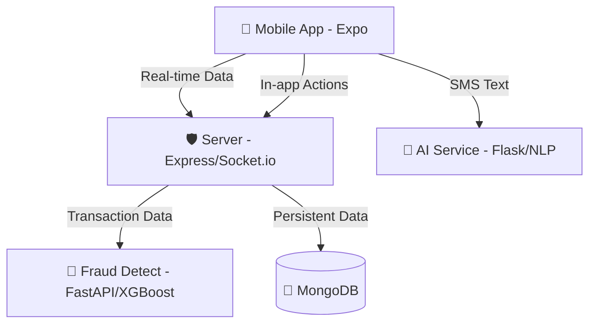

[README.md](https://github.com/user-attachments/files/26855231/README.md)
# 💰 MoneyMate 2.0 — All-in-One GenZ Fintech Ecosystem

> **The ultimate financial companion for the next generation.**  
> MoneyMate 2.0 combines real-time transaction tracking, AI-powered SMS intelligence, parental controls, and advanced fraud detection into a single, high-performance ecosystem.

---

## 🏗️ Ecosystem Architecture

The platform is built as a modular microservices architecture, ensuring scalability and performance across different financial tasks.



---

## 📂 Project Structure

| Component | Directory | Description |
|---|---|---|
| **Frontend** | `/frontend` | React Native (Expo) app with Glassmorphism UI. |
| **Backend** | `/server` | Node.js/Express orchestration layer with WebSockets. |
| **AI Insights** | `/ai-service` | Flask service for SMS classification & anomaly detection. |
| **Fraud Shield** | `/fraud-detect` | ML service for real-time transaction risk scoring. |

---

## 🚀 Quick Start Guide

### Prerequisites
- **Node.js**: v18+ 
- **Python**: v3.9+ 
- **MongoDB**: v6.0+ (Running locally or via Atlas)
- **Expo Go**: Installed on your mobile device (for testing)

### Step 1: Start the Backend (Server)
```bash
cd server
npm install
npm run dev
```

### Step 2: Start the AI Services
```bash
# Terminal A (SMS Analysis)
cd ai-service
pip install -r requirements.txt
python app.py

# Terminal B (Fraud Detection)
cd fraud-detect
pip install -r requirements.txt
uvicorn backend:app --reload --port 8000
```

### Step 3: Start the Mobile App
```bash
cd frontend
npm install
npx expo start
```

---

## ✨ Key Features

- **Smart Ledger**: Automatically categorizes bank SMS into a clean, searchable ledger.
- **Message Cabinet**: Isolates OTPs, E-commerce, and Spam from financial data with auto-delete rules.
- **Parental Control**: Allows parents to monitor child spending and set safety thresholds.
- **Fraud Shield**: Scans every transaction in real-time using XGBoost to detect anomalies.
- **Electric Obsidian UI**: A premium, high-contrast theme designed for clarity and engagement.

---

## 🛠️ Tech Stack

- **Mobile**: React Native, Expo, Reanimated 3, Linear Gradient, BlurView.
- **Backend**: Node.js, Express, Socket.io, Mongoose (MongoDB).
- **AI/ML**: Python (FastAPI/Flask), XGBoost, Scikit-learn, TF-IDF.
- **Payments**: Razorpay Integration for manual fund handling.

---

*MoneyMate — Empowering Gen Z with Financial Intelligence.*
